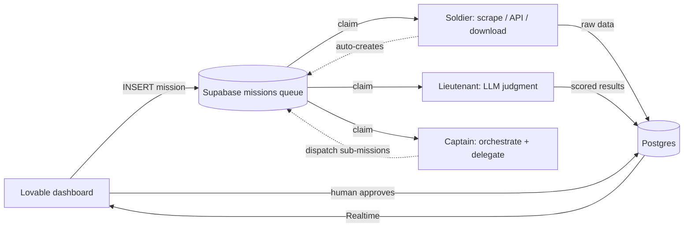

# BetaGroup AI Army — A Production Multi-Agent LLM System

> A fleet of specialized LLM agents that amplifies human productivity across an
> **ocean of pre-existing data** — 8,000,000+ public-procurement contracts,
> 50,000+ résumés, and thousands of dense tender documents — spanning tender
> discovery, proposal writing, partner sourcing, legal verification, and
> recruiting in Colombia and Spain. Built and operated solo.

**Author:** Jorge García · [github.com/jorgegarcia205](https://github.com/jorgegarcia205) · jm.garcia380@gmail.com
*(Curated portfolio for the [Singapore AI Safety Fellowship](https://www.aisafety.sg/programs/singapore-ai-safety-fellowship). The production system is private; this repository documents its architecture and shares sanitized, representative code.)*

---

## 1. The core problem: productivity inside a sea of data

None of the hard problems here are a single prompt. They are all variants of the
same thing: **there is far more relevant data than any human can read.**

- ~**8 million** public contracts in Colombia's SECOP open database.
- **50,000+** résumés in the internal talent pool.
- **Thousands** of tender documents (*pliegos*), each dozens to hundreds of pages
  of legal and technical specification.

A consultancy that wants to win public tenders must, continuously: find the
right tenders, decide go/no-go, assemble a team whose credentials survive audit,
find partner companies to co-bid with, verify their legal standing, and write a
winning technical methodology. By hand this does not scale.

So I built an **army of narrow, coordinated agents**, each of which turns one
slice of that ocean into a decision-ready output — with a human approving every
consequential step.

---

## 2. The agent hierarchy

Every agent inherits from one `BaseAgent` and owns exactly one job. Rank encodes
**responsibility**, and it maps cleanly onto a division of cognitive labor that,
in hindsight, is a practical answer to "how do you compose LLMs safely":

| Rank | Role | Uses an LLM? | Concrete examples in the system |
|---|---|---|---|
| **Soldier** (L1) | Deterministic execution — get the raw data | ❌ No (pure scripts) | Résumé scraper (Playwright), RUES legal-standing verifier, PLACSP tender scraper, *pliego* downloader, SECOP API puller, Telegram notifier |
| **Lieutenant** (L2) | Judgment — evaluate / analyze / parse what soldiers gathered | ✅ Yes | Talent evaluator, tender go/no-go analyst (CO & ES), *pliego* parser, strategic analyst, methodology QA, natural-language query parser |
| **Captain** (L3) | Orchestration of a whole domain — pre-filter, consolidate, dispatch sub-missions | ✅ Yes | Talent-DB evaluator (evaluates the whole pool against a tender), Partners-SECOP captain (keyword expansion + search) |
| **Commander** (L3+) | Strategy & generation — produce the final artifact | ✅ Yes | Methodology generator (writes the proposal), go/no-go consolidation |
| **General** (L4) | Top-level assignment & monitoring | — | Lovable dashboard + orchestration logic |

**Why this matters beyond org-chart cuteness:** soldiers are LLM-free and
therefore auditable and cheap; lieutenants are where judgment (and hallucination
risk) lives, so that is exactly where the evidence-grounding and output
validation are concentrated; captains never do fine-grained work themselves,
they decompose it into missions and **delegate** (e.g. the Partners captain hands
each candidate NIT to the RUES soldier). Capability and autonomy increase with
rank, and so does the human review attached to the output.

```
GENERAL      Orchestration & assignment
  └ COMMANDER   Strategy / generation of the final artifact
     └ CAPTAIN     Domain orchestration, pre-filter, delegation
        └ LIEUTENANT  LLM judgment: evaluate / analyze / parse
           └ SOLDIER     Deterministic execution: scrape / download / extract
```

---

## 3. What the army actually does (the subsystems)

### A. Talent sourcing & evidence-grounded evaluation *(Colombia)*
Browser **soldiers** scrape résumés; a pipeline homogenizes 50k+ of them against
Colombia's official **SNIES** education taxonomy (8 knowledge areas → *núcleos
básicos* → canonical professions) — 99.4% by rules, no LLM cost. A **captain**
then evaluates the whole pool against a specific tender's mandatory/scored
requirements using an evidence-grounded prompt (see §4.2), sorting people into
*eligible / manageable / rejected*. A natural-language search ("civil engineer
with 2 master's in engineering, 5+ yrs, Bogotá") is parsed by an LLM into
structured SQL filters over canonical columns. Records are deduplicated
(50,044 → 27,956 real people).

### B. Partner discovery over the SECOP open API *(Colombia)*
To co-bid on large tenders you need partner companies with the right track
record. A **captain** queries Colombia's **SECOP** public API (~8M contracts):
- **Phase 1 (LLM):** expands a theme into candidate keywords, and *remembers
  within a search cycle which keywords were already used vs. not*.
- **Phase 2:** runs exact-keyword queries against the API, then applies AI to
  rank fit — reporting **clear indicators** (number of contracts on the theme,
  totals, and a breakdown **by contract modality**: direct award, merit
  competition, public tender, auction, special regime), **excluding public
  entities**, and handling **consortia** as a separate case (no RUP, single
  contract). It then **delegates legal verification** of each candidate to the
  RUES soldier (subsystem C).

### C. Legal-standing verification via RUES *(Colombia)*
A browser **soldier** visits `rues.org.co`, switches the registry to
*Proponentes*, enters a company's NIT, and extracts whether a valid **RUP**
(bidder registration) exists and — critically — its **renewal date**. Supports
a single NIT or an Excel batch. This is the "is this partner actually allowed to
bid?" check.

### D. Tender detection & go/no-go analysis *(Colombia & Spain)*
- **Colombia:** an analyst **lieutenant** scores incoming tenders against a rules
  engine and pushes **Telegram alerts** above a configurable threshold.
- **Spain (PLACSP):** soldiers run a mass search on
  `contrataciondelestado.es`, a scheduler enqueues extract/analyze missions, and
  a **lieutenant** downloads the *pliegos* and produces a structured go/no-go
  read — so a human sees a ranked shortlist instead of a raw firehose.

### E. Winning-proposal methodology generation *(Spain)*
The most complex pipeline: an 8-stage flow (Pliego → Classification → Research →
Generation → Editing → Cohesion → Graphics → Roundtable) that reads both the
technical (**PPT**) and administrative (**PCAP**) specification documents,
extracts the scoring criteria, and drafts a scored technical methodology. A
**parser lieutenant** structures the *pliego*; a **strategic-analysis
lieutenant** performs a deep multi-layer read (pinned to a strong reasoning model
because its output feeds every later stage); a **commander** generates the
document. There is a mandatory **human index-review checkpoint** before
generation — the system proposes an outline and waits for approval.

### F. Marketing content generation *(secondary)*
A conversational agent turns a product (photos or URL) into a full advertising
plan + branded PDF, with optional media (voiceover, images, short video). It
also demonstrates the human-approval pattern: it produces a **plan for approval
first**, and only generates content after the human signs off — and applies
surgical edits rather than regenerating from scratch.

---

## 4. Cross-cutting engineering

### 4.1 Asynchronous mission queue (no direct agent-to-agent calls)
All coordination flows through a Postgres `missions` table. An agent claims a
mission by polling, does its job, writes results, and leaves the mission in a
**`review`** state for a human. This gives observability (every hand-off is a
row), restartability (kill any container; missions persist), and no cascading
failure. See [`code_samples/base_agent.py`](code_samples/base_agent.py).



### 4.2 Reliability-first LLM client
One client wraps every model call with a **provider fallback chain**
(Gemini → OpenAI → Anthropic). Transient errors retry; **account-level** errors
(spend cap / billing) skip the whole provider instead of hammering it. Every
structured call is validated as JSON and retried on malformed output. See
[`code_samples/llm_fallback.py`](code_samples/llm_fallback.py).

### 4.3 Rule-first data, LLM-last
Wherever a deterministic rule can do the job, it does — the SNIES classifier
handles 99.4% of 50k records with zero LLM cost; the LLM is reserved for the
genuine long tail. See [`code_samples/profession_taxonomy.py`](code_samples/profession_taxonomy.py).

---

## 5. Engineering for reliable & overseeable AI

This is applied engineering, not safety research — but building *autonomous*
multi-agent LLM systems in production forced me to confront, concretely, several
problems the AI-safety community cares about:

- **Humans hold the commit bit.** Agents finish in `review`; consequential
  outputs (candidate short-lists, proposal outlines, advertising plans) require
  explicit human approval. Default is *stop and ask*, not *act*.
- **Hallucination is a failure mode to engineer against.** Evaluation prompts
  require verbatim evidence and make "no evidence" resolve to **rejection**;
  the model's output is then validated and bounded before it is persisted. See
  [`code_samples/evaluation_prompt.py`](code_samples/evaluation_prompt.py).
- **Silent, confident wrongness is the real danger.** The hardest bugs were
  agents doing the *wrong* thing quietly (a mis-selected search filter that
  silently cut 803 results to 51; a scraper capturing a job title instead of a
  name). I added comparison checks and diagnostics specifically to surface
  wrong-but-plausible actions.
- **Graceful degradation over brittle confidence**, and **observability by
  construction** (every action logged, progress + heartbeats emitted, the queue
  fully inspectable and replayable).

These are exactly the instincts I want to sharpen through formal AI-safety work:
keeping capable autonomous systems **evaluable, correctable, and under human
control** as they scale.

---

## 6. Scale & results

- ~**26** registered agents across 5 domains and 2 countries, on 3 always-on services.
- **8M+** SECOP contracts queried for partner discovery; **50,044** résumés
  processed → **27,956** unique people after deduplication.
- **99.4%** of the résumé corpus auto-classified to the SNIES taxonomy by rules.
- Evaluation pipeline parallelized (bounded concurrency + blocking DB writes
  moved off the event loop): from a sequential ~2h job toward ~10 minutes.

---

## 7. Tech stack

**Python 3.11** (asyncio) · **Supabase/PostgreSQL** (mission queue + store +
Realtime) · **Playwright** (browser automation) · **LLMs**: OpenAI, Google
Gemini, Anthropic (with fallback) · public **SECOP** & **RUES** data sources ·
**Docker** + **Railway** · **Lovable/React** frontend · **ReportLab** (PDF) ·
**ElevenLabs / FLUX / Kling** (media).

---

## 8. Repository contents

```
betagroup-portfolio/
├── README.md                     ← this file
├── docs/ARCHITECTURE.md          ← full component & data-flow map
└── code_samples/                 ← sanitized, self-contained excerpts
    ├── base_agent.py             ← the async mission-queue agent loop
    ├── llm_fallback.py           ← provider fallback + JSON-safe calls
    ├── profession_taxonomy.py    ← rule-based SNIES classifier
    └── evaluation_prompt.py      ← evidence-grounded evaluation prompt
```

> **Security note:** no credentials, API keys, personal data, or client-specific
> business logic are included. All excerpts are sanitized. The production system
> is private.

---

## 9. What I would improve next

- Fine-grained progress/heartbeat writes so long LLM stages show a live progress
  bar instead of a coarse phase label.
- Canonicalize records on ingestion, not only via batch backfill.
- A small **evaluation harness** (regression tests over a labeled set) so prompt
  edits cannot silently degrade judgment quality — the closest thing to
  "unit tests for an LLM's reasoning."
