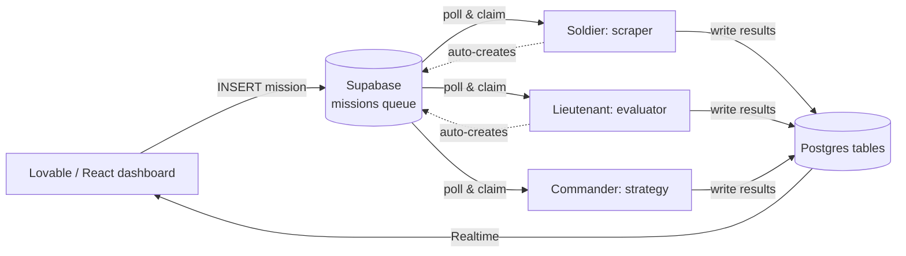

# BetaGroup AI Army — A Production Multi-Agent LLM System

> A fleet of specialized LLM agents that automates public-procurement and talent
> workflows end-to-end across Colombia and Spain. Built and operated solo:
> ~26 autonomous agents, 50,000+ processed résumés, multi-provider LLM
> orchestration, and human-in-the-loop review at every consequential step.

**Author:** Jorge García · [github.com/jorgegarcia205](https://github.com/jorgegarcia205) · jm.garcia380@gmail.com
*(Prepared as a curated portfolio for the [Singapore AI Safety Fellowship](https://www.aisafety.sg/programs/singapore-ai-safety-fellowship). The full production system is kept in a private repository for security and IP reasons; this repository documents the architecture and shares sanitized, representative code.)*

---

## 1. TL;DR

BetaGroup AI Army is a real, in-production system that turns a labor-intensive
consulting workflow — finding public tenders, assembling qualified teams, and
producing winning proposals — into an orchestrated set of autonomous LLM agents.

| | |
|---|---|
| **Scale** | 50,044 résumés ingested → 27,956 unique people after dedup; ~26 registered agents; 3 deployment services |
| **Agents** | Military hierarchy: General → Commander → Lieutenant → Soldier, each a Python class |
| **LLM layer** | Provider-agnostic client with an automatic fallback chain (Gemini → OpenAI → Anthropic), retries, timeouts, and spend-cap detection |
| **Coordination** | Fully asynchronous mission-queue over Postgres (Supabase); agents never call each other directly |
| **Automation** | Playwright browser agents with resilient DOM extraction and human-like behavior |
| **Deployment** | Docker + Railway, multiple always-on containers |
| **Frontend** | Lovable/React dashboard that dispatches missions and renders results |

The system is not itself AI-safety research, but it was engineered around
principles that matter for **safe deployment of autonomous LLM systems**:
graceful degradation, evidence-grounded evaluation to suppress hallucination,
structured-output validation, and mandatory human checkpoints. Those are
discussed explicitly in [Section 6](#6-engineering-for-reliable--overseeable-ai).

---

## 2. The problem

Public procurement in Latin America and Spain is high-value but operationally
brutal: thousands of tenders, each with dense legal/technical specification
documents (*pliegos*), strict disqualifying requirements, and a need to
assemble teams whose credentials survive audit. Doing this by hand is slow and
error-prone.

I built an "army" of agents that each own a narrow, verifiable task, and a
coordination layer that lets them work concurrently without stepping on each
other — with a human approving every decision that leaves a mark.

---

## 3. Architecture

### 3.1 Agent hierarchy

Every agent inherits from a single `BaseAgent` and has one job. Rank encodes
responsibility, not privilege:

```
GENERAL      (L4)  Orchestration & mission assignment
  └ COMMANDER (L3)  Area strategy, consolidation, GO/NO-GO decisions
     └ LIEUTENANT (L2)  Quality control, LLM evaluation, prioritization
        └ SOLDIER (L1)  Execution: scraping, downloading, extraction
```

### 3.2 Asynchronous mission queue

Agents are decoupled through a Postgres `missions` table. Lovable (or another
agent) inserts a mission; the responsible agent claims it by polling; results
are written back and surfaced via Supabase Realtime. No agent ever calls
another directly — this makes the system observable, restartable, and immune to
cascading failure.



A mission moves through an explicit lifecycle
(`queued → in_progress → review → completed / failed`), and an agent that
finishes work leaves it in **`review`** — a human, not the machine, promotes it
to `completed`.

### 3.3 Deployment topology

Three always-on Railway containers, split by resource profile:

- **Scrapers** — Playwright/Chromium browser agents (RAM-heavy).
- **Evaluators** — pure LLM + DB agents (light), including the talent
  evaluator and the natural-language search agent.
- **Vigilance** — email intake, marketing generation, and the Spain
  methodology pipeline.

See [`docs/ARCHITECTURE.md`](docs/ARCHITECTURE.md) for the full component map.

---

## 4. Selected subsystems

### 4.1 Provider-agnostic LLM client with a reliability-first fallback chain

A single client wraps every LLM call. If a provider is overloaded, rate-limited,
or hits an account-level spend cap, it degrades gracefully down a chain rather
than failing the task. Account-level errors (e.g. billing/spend-cap) skip an
entire provider instead of wastefully retrying it.

```python
# Sanitized excerpt — see code_samples/llm_fallback.py
def _get_fallback_chain(self, failed_provider, failed_model, last_error):
    """Return the ordered list of (provider, model) to try next.

    If the error is account-level (spend cap / billing), skip EVERY model of
    that provider — retrying the same account will only fail again.
    """
    chain = [("gemini", "gemini-2.5-flash"),
             ("openai", "gpt-4o-mini"),
             ("anthropic", "claude-...")]
    if self._is_account_level_error(last_error):
        chain = [(p, m) for (p, m) in chain if p != failed_provider]
    return chain
```

Every structured call goes through `chat_json`, which strips markdown fences,
validates the JSON, and **retries on malformed output** — so a single bad
generation never corrupts downstream state.

### 4.2 Evidence-grounded evaluation engine (anti-hallucination by design)

The most safety-relevant component. A "Captain" agent evaluates each résumé
against a tender's mandatory and scored requirements. The prompt is engineered
so the model **cannot pass a candidate on absent evidence** — the default for
"the CV says nothing about this" is *fail*, never *maybe*:

```text
EVIDENCE IS MANDATORY. Every conclusion MUST cite verbatim text from the CV.
Do not invent data. If there is no evidence in the CV, the correct conclusion
is NO_CUMPLE (does not meet) — never OBSERVACION and never CUMPLE.

A degree with no graduation year AND no evidence it was completed
-> treat as NOT completed -> NO_CUMPLE.
```

The model returns a strict JSON verdict per requirement (`CUMPLE / NO_CUMPLE /
OBSERVACION`) with the citation, and the code **sanitizes and bounds** the
result before it is ever persisted. This turns an LLM from a plausible-sounding
narrator into an auditable evaluator.

### 4.3 Data homogenization against an official taxonomy

50,000+ scraped résumés had inconsistent, sometimes corrupted profession/degree
fields. I mapped them to Colombia's **official SNIES higher-education taxonomy**
(8 knowledge areas → *núcleos básicos* → canonical professions). A rule-based
classifier — no LLM cost — covers **99.4%** of records; the remaining long tail
is reserved for an LLM pass.

Crucially, every academic title (undergraduate *and* each postgraduate) is
normalized with its level + area, which makes structured queries like
*"civil engineer with two master's degrees in engineering"* answerable in SQL.

```python
# Sanitized excerpt — see code_samples/profession_taxonomy.py
def classify_title(raw):
    n = normalize_text(raw)                 # upper, strip accents, Ñ->N
    for keywords, canonical, nbc, area in RULES:  # ordered, specific-first
        if all(kw in n for kw in keywords):
            return {"profession_canonical": canonical,
                    "snies_nbc": nbc, "snies_area": area}
    return None                              # -> LLM fallback / uncategorized
```

### 4.4 Natural-language talent search

A user types *"civil engineer with 2 master's in engineering, 5+ years, in
Bogotá"*. An LLM (pinned to a JSON-reliable model) parses it into **structured
filters**, which are executed by a SQL function over the canonical columns —
LLM for understanding, deterministic SQL for retrieval. The LLM never touches
the data directly; it only produces a validated filter object.

### 4.5 Resilient web automation

Browser soldiers log in and extract data with Playwright, using human-like
delays, DOM walkers that survive markup changes, and diagnostic dumps when a
selector drifts. A representative bug I fixed: a profession autocomplete was
silently selecting a *narrower* option (`"Doctorate in Economics"` instead of
`"Economics"`), collapsing 803 results to 51. The fix scores suggestions by
exact/shortest match — a reminder that in agentic systems, *silent* wrong
actions are more dangerous than loud failures.

---

## 5. Scale & results

- **50,044** résumés ingested; **27,956** unique people after email/document-based
  deduplication (removing 22,888 duplicate records, one profile had 107 copies).
- **99.4%** of the corpus auto-classified to the SNIES taxonomy by rules alone.
- Parallelized the evaluation pipeline (bounded concurrency + moving blocking
  DB writes off the event loop) — from a sequential ~2h job toward a ~10-minute one.
- End-to-end structured search verified in production against real data.

---

## 6. Engineering for reliable & overseeable AI

This project is applied engineering, not safety research — but building an
*autonomous* multi-agent LLM system in production forced me to confront, in
concrete terms, several problems the AI-safety community cares about:

- **Human oversight is mandatory, not optional.** Agents finish work in a
  `review` state; consequential outputs (advertising plans, methodology
  indexes, candidate short-lists) require explicit human approval before they
  take effect. The default is *stop and ask*, not *act*.
- **Hallucination is treated as a failure mode to engineer against.** The
  evaluation prompts require verbatim evidence and make "no evidence" resolve to
  rejection, then the code validates and bounds the model's output.
- **Graceful degradation over brittle confidence.** Multi-provider fallback,
  timeouts, idempotent retries, and account-level error detection keep a single
  provider incident from taking down the fleet.
- **Silent misbehavior is the real risk.** Several of the hardest bugs were
  agents doing the *wrong* thing confidently and quietly (a mis-selected filter,
  a mis-parsed name). I added diagnostics and comparison checks specifically to
  make wrong-but-plausible actions visible.
- **Observability by construction.** Every action is logged; agents emit
  progress and heartbeats; the queue makes the whole system inspectable and
  restartable.

These are exactly the instincts I want to sharpen through formal AI-safety work:
how to make capable autonomous systems that remain **evaluable, correctable, and
under human control** as they scale.

---

## 7. Tech stack

**Python 3.11** (asyncio) · **Supabase/PostgreSQL** (queue + store + Realtime) ·
**Playwright** (browser automation) · **LLMs**: OpenAI, Google Gemini, Anthropic
(with fallback) · **Docker** + **Railway** · **Lovable/React** frontend ·
**ReportLab** (PDF) · **ElevenLabs / FLUX / Kling** (media generation).

---

## 8. Repository contents

```
betagroup-portfolio/
├── README.md                     ← this file
├── docs/
│   └── ARCHITECTURE.md           ← full component & data-flow map
└── code_samples/                 ← sanitized, self-contained excerpts
    ├── base_agent.py             ← the async mission-queue agent loop
    ├── llm_fallback.py           ← provider fallback + JSON-safe calls
    ├── profession_taxonomy.py    ← rule-based SNIES classifier
    └── evaluation_prompt.py      ← evidence-grounded evaluation prompt
```

> **Security note:** No credentials, API keys, personal data, or client-specific
> business logic are included in this repository. All excerpts are sanitized and
> illustrative. The production system is private.

---

## 9. What I would improve next

- Add fine-grained progress/heartbeat writes so long LLM steps are observable
  as a live progress bar rather than a coarse phase label.
- Move canonicalization into the ingestion path so new records are normalized on
  write, not only via batch backfill.
- Add automatic evaluation-set regression tests for prompt changes (a small
  "eval harness" so prompt edits can't silently degrade judgment quality).
