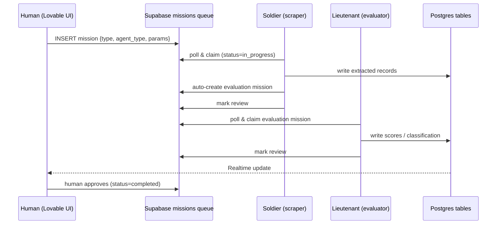

# Architecture

This document expands on the system summarized in the top-level
[README](../README.md). It reflects a real production system; identifiers and
business-specific rules have been generalized.

## 1. Design principles

1. **One agent, one verifiable job.** Every agent inherits from a single
   `BaseAgent` and does exactly one thing. This keeps each unit testable and
   makes failures local.
2. **No direct agent-to-agent calls.** All coordination flows through a Postgres
   `missions` queue. This buys observability (every hand-off is a row),
   restartability (kill any container, missions persist), and back-pressure.
3. **Humans hold the commit bit.** Agents finish in a `review` state; a person
   promotes work to `completed`. The machine proposes; the human disposes.
4. **Degrade, don't crash.** Every external dependency (LLM provider, browser,
   DB) is wrapped with retries/fallbacks/timeouts.

## 2. Data-flow

## 3. Component map

| Layer | Component | Responsibility |
|---|---|---|
| Frontend | Lovable/React dashboard | Dispatch missions, render results, human approval |
| Queue/Store | Supabase (Postgres + Realtime) | Mission queue, canonical data store, event bus |
| Core | `BaseAgent` | Poll → claim → `execute()` → `review`; logging & heartbeat |
| Core | `LLMClient` | Provider-agnostic calls, fallback chain, JSON validation |
| Core | `MissionManager` | CRUD, deduplication, status transitions |
| Agents (Soldiers) | Browser scrapers | Playwright login + resilient extraction |
| Agents (Lieutenants) | Evaluators / parsers | LLM scoring, taxonomy, NL query parsing |
| Agents (Commanders) | Strategy | Consolidation, GO/NO-GO, methodology generation |
| Infra | Docker + Railway | Three containers split by resource profile |

## 4. Reliability mechanisms

- **LLM fallback chain** with account-level error detection (spend-cap/billing
  errors skip a whole provider instead of retrying it).
- **`chat_json`**: markdown-fence stripping + JSON validation + retry on
  malformed output.
- **Bounded concurrency** (`asyncio.Semaphore`) for batch evaluation, with
  blocking DB writes pushed off the event loop via `asyncio.to_thread`.
- **Idempotent batch jobs** (backfills/dedup) with `--dry-run`, `--only-missing`,
  and per-row retry/back-off — safe to re-run after partial failures.
- **Explicit timeouts** on long agent operations, surfaced as actionable errors.

## 5. Data model highlights

- `missions` — the queue (typed `mission_type` enum, status lifecycle).
- `talent_candidates` — résumés, plus canonical SNIES columns
  (`profession_canonical`, `snies_area`, `snies_nbc`,
  `education_level_canonical`, `education_normalized` JSONB, postgraduate
  counters, `is_duplicate`).
- Advanced search is exposed as a SQL function so array/JSONB predicates (e.g.
  "≥2 master's in a given knowledge area") run in the database, not the client.

## 6. Domains (what the fleet covers)

| Domain | Country | Representative agents (rank) |
|---|---|---|
| Talent sourcing & evaluation | CO | résumé scraper (S), talent evaluator captain (C), NL-search parser (L) |
| Partner discovery over SECOP API | CO | partners-SECOP captain (C) → delegates to RUES soldier |
| Legal-standing verification (RUES) | CO | RUES/RUP verifier (S) |
| Tender detection & go/no-go | CO / ES | PLACSP scraper (S), tender analysts (L), Telegram notifier (S) |
| Proposal-methodology generation | ES | pliego parser (L), strategic analyst (L), generator commander (Cmd), QA (L) |
| Marketing content generation | — | concierge (L), media producer (S) |

Each domain is independent at the queue level: they share the `BaseAgent`,
`LLMClient`, and `missions` infrastructure, but their agents never block one
another. A domain can be deployed, scaled, or disabled via an env flag without
touching the others.

## 7. Testing & operability

- Batch scripts default to `--dry-run` to measure impact before writing.
- Every agent action is logged; agents report progress every N units so a stuck
  job is visible.
- Missions can be replayed by resetting their status — no bespoke recovery code.
